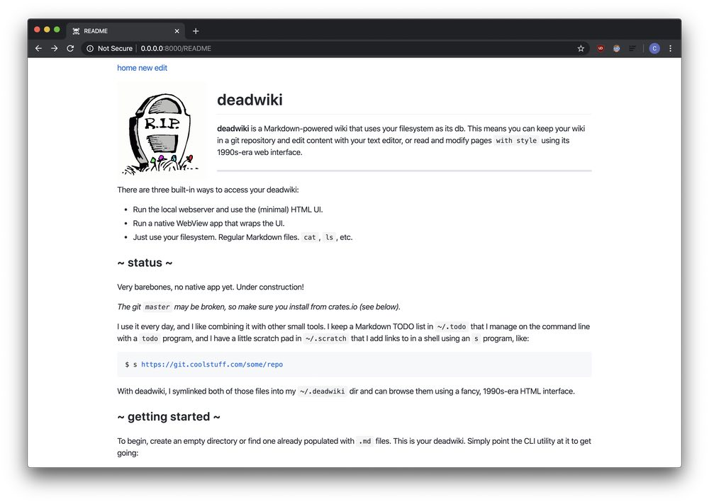
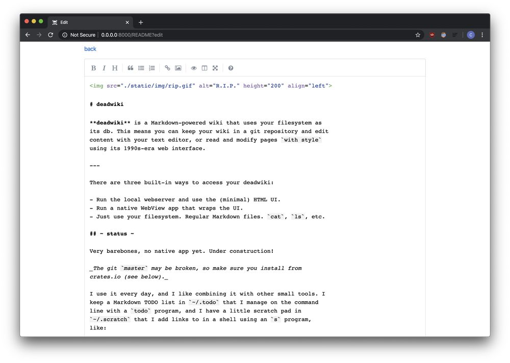

# deadwiki

**deadwiki** is a Markdown-powered wiki that uses your filesystem as
its db. This means you can keep your wiki in a git repository and edit
content with your text editor, or read and modify pages `with style`
using its 1990s-era web interface.

---

There are three built-in ways to access your deadwiki:

- Run the local webserver and use the (minimal) HTML UI.
- Run a native WebView app that wraps the UI.
- Just use your filesystem. Regular Markdown files. `cat`, `ls`, etc.

## ~ status ~

Very barebones, no native app yet. Under construction!

_The git `master` may be broken, so make sure you install from
crates.io (see below)._

I use it every day, and I like combining it with other small tools. I
keep a Markdown TODO list in `~/.todo` that I manage on the command
line with a `todo` program, and I have a little scratch pad in
`~/.scratch` that I add links to in a shell using an `s` program,
like:

    $ s https://git.coolstuff.com/some/repo

With deadwiki, I symlinked both of those files into my `~/.deadwiki`
dir and can browse them using a fancy, 1990s-era HTML interface.

## ~ getting started ~

To begin, create an empty directory or find one already populated with
`.md` files. This is your deadwiki. Simply point the CLI utility at it
to get going:

    $ dead my-wiki-dir/
    -> deadwiki serving my-wiki-dir/ at http://0.0.0.0:8000

Now visit http://0.0.0.0:8000/ in your browser! (Or don't. It's up to
you.)

You can edit wiki pages locally with something like `vim`, or by using
the web UI. Edits show up on the next page load, as do new pages -
there is no database and no fancy pantsy caching. Just you, your
filesystem, and a dream.

In addition to [CommonMark], Markdown files can link to each other by
putting the `[Page Name]` in brackets. Like most wikis, it'll either
be a link to the actual page or a way to create it.

Finally, if you want to sync your wiki automatically, there is some
_very basic_ git support. Basically, if you start the `dead`
program with the `-s` or `--sync` flag and point it at an existing git
repository, it'll do this every 30 seconds or so:

    git add .
    git commit -am update
    git pull origin master
    git push origin master

Like I said, super basic! But it works.

## ~ keyboard shortcuts ~

Web-based wiki editing uses [SimpleMDE], plus a dash of other
shortcuts in editor mode:

| **Shortcut**   | **Notes**                        |
| -------------- | -------------------------------- |
| `Double Click` | Enters edit mode for a wiki page |
| `ESC`          | Exits edit mode                  |
| `Ctrl+Enter`   | Submits your edits               |
| `Cmd+Enter`    | Same                             |
| `Cmd-'`        | Toggle Blockquote                |
| `Cmd-B`        | Toggle Bold                      |
| `Cmd-E`        | Clean Block                      |
| `Cmd-H`        | Toggle Heading (Smaller)         |
| `Cmd-I`        | Toggle Italic                    |
| `Cmd-K`        | Draw Link                        |
| `Cmd-L`        | Toggle Unordered List            |
| `Cmd-P`        | Toggle Preview                   |
| `Cmd-Alt-C`    | Toggle Code Block                |
| `Cmd-Alt-I`    | Draw Image                       |
| `Cmd-Alt-L`    | Toggle Ordered LIST              |
| `Shift-Cmd-H`  | Toggle Heading (Bigger)          |
| `F9`           | Toggle Side-By-Side              |
| `F11`          | Toggle Fullscreen                |

## ~ installation ~

Hey, how do I get that handy dandy `dead` CLI utility? With [cargo]:

    cargo install deadwiki

Now you should be able to run `dead -h` to see the possibilities.

## ~ hacking ~

The code is in pretty rough shape right now, so enter at your own
risk, but you can hack on it pretty easily using [cargo]:

    $ git clone https://github.com/xvxx/deadwiki
    $ cd deadwiki
    $ cargo run wiki/

There's a basic wiki included that shows off some features.

## ~ future features ~

- search
- jump to page (via fuzzy finder)
- `--gopher`: serve wiki pages over gopher too, probably using [phd]
- `*.css` in wiki dir gets included

## ~ philosophy ~

- no database
- text editor/plain text friendly
- prefer server-side rendering
- take your data with you (scm friendly)
- js only for user input (keyboard shortcuts, markdown editor, finder)
- no js frameworks/helpers
- build time matters (72 crates currently, ~22s release ~10s debug)

## ~ screenies ~

|  |  |
| :-------------------------------------: | :-------------------------------------: |
|       Rendering Markdown. `Wow.`        |      Editing Markdown. `Amazing.`       |

## ~ bug reports ~

Please direct all known and unknown (suspected) bugs to this URL:

- https://github.com/xvxx/deadwiki/issues/new

[cargo]: https://rustup.rs
[simplemde]: https://simplemde.com/
[keys]: https://github.com/sparksuite/simplemde-markdown-editor#keyboard-shortcuts
[commonmark]: https://commonmark.org/
[phd]: https://github.com/xvxx/phd
